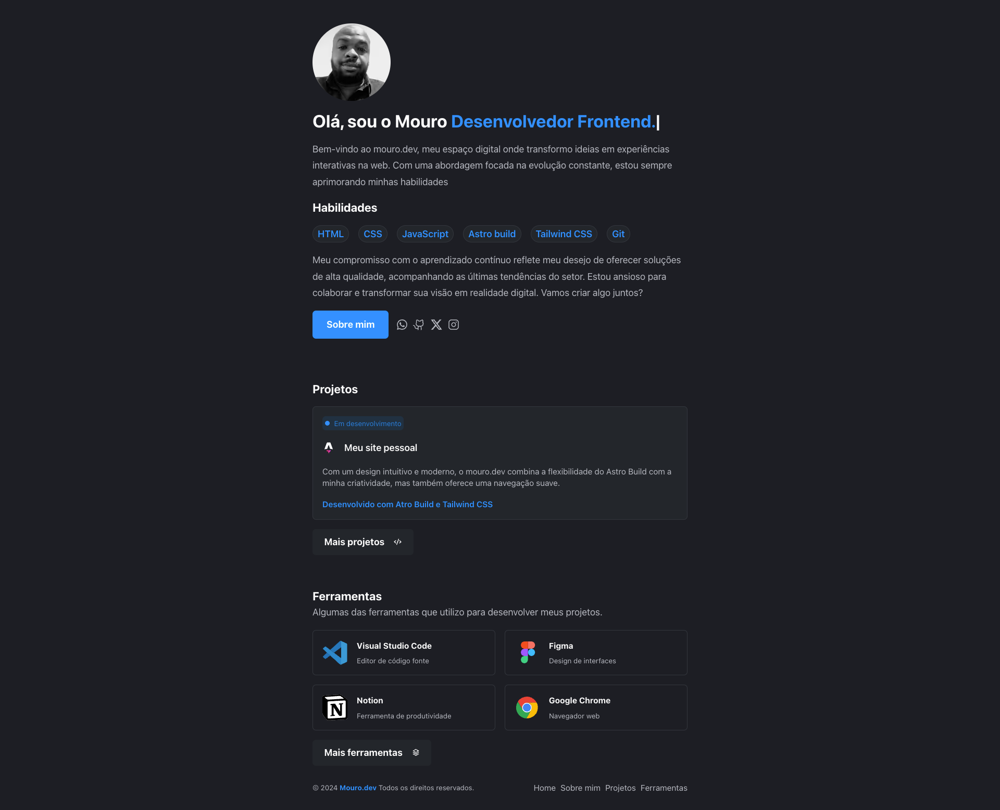

# Meu Site Pessoal - Construído com Astro e Tailwind CSS

> 🧑‍🚀 **mouro.dev** Seja bem-vindo!



## 🚀 Estrutura do Projeto

Dentro do seu projeto, você verá as seguintes pastas e arquivos:

```text
/
├── public/
│   └── favicon.svg
├── src/
│   ├── components/
│   │   └── Card.astro
│   ├── layouts/
│   │   └── Layout.astro
│   └── pages/
│       └── index.astro
└── package.json
```


## Breve Explicação sobre o Projeto

Este projeto é desenvolvido com o framework Astro, uma plataforma moderna e flexível para construção de aplicativos web de alto desempenho e reativos. O Astro combina as melhores práticas de desenvolvimento web com ferramentas familiares como React, Vue e Angular.

## 🌟 Visão Geral do Projeto

- **Estrutura do Projeto**: O projeto segue uma estrutura organizada, com páginas estáticas e dinâmicas no diretório `src/pages/`, onde cada arquivo `.astro` ou `.md` representa uma rota no aplicativo. Os componentes reutilizáveis são armazenados em `src/components/`.
  
- **Ativos Estáticos**: Imagens e arquivos CSS são gerenciados no diretório `public/`.

Este projeto promete oferecer uma experiência de desenvolvimento moderna, eficiente e altamente performática para a criação de aplicativos web de alta qualidade.

## 🎨 Tailwind CSS
Este projeto utiliza o Tailwind CSS, um framework CSS utilitário que permite a construção rápida e eficiente de interfaces de usuário personalizadas. Com Tailwind CSS, você pode aplicar estilos diretamente nos elementos HTML usando classes utilitárias, o que torna o processo de estilização mais intuitivo e flexível.


### 🧞 Commands

Todas as instruções são executadas a partir da raiz do projeto, a partir de um terminal:

| Comando                  | Ação                                           |
| :------------------------ | :----------------------------------------------- |
| `pnpm install`             | Installs dependencies                            |
| `pnpm run dev`             | Starts local dev server at `localhost:4321`      |
| `pnpm run build`           | Build your production site to `./dist/`          |
| `pnpm run preview`         | Preview your build locally, before deploying     |
| `pnpm run astro ...`       | Run CLI commands like `astro add`, `astro check` |
| `pnpm run astro -- --help` | Get help using the Astro CLI                     |

## 🛠️ Contribuição
Se você quiser contribuir para este projeto, sinta-se à vontade para abrir pull requests e relatar problemas no repositório. Toda ajuda é bem-vinda!

## 🔗 Links Úteis

- [Documentação do Astro](https://docs.astro.build)
- [Documentação do Tailwind CSS](https://tailwindcss.com/docs)
  


